<div align="center">

<picture>
  <source media="(prefers-color-scheme: dark)" srcset="./dark.svg">
  <source media="(prefers-color-scheme: light)" srcset="./light.svg">
  
</picture>

</div>

<br>

I'm an Industrial Biotechnology student in the B.S. Biomanufacturing program at Solano Community College. I'm interested in how biology, biomanufacturing, and computation work together — from expressing a protein in a cell to looking at its structure on a screen.

Right now I'm learning bioinformatics and structural biology tools alongside my lab coursework.

### Focus

- 🏭 **Biomanufacturing** — producing proteins and other products with living cells
- 🧬 **Molecular biology & proteins** — gene expression, protein work, protein–ligand analysis
- 💻 **Bioinformatics & computational biology** — sequence analysis, structure validation, docking
- 🤖 **AI for biology** — an area I'm starting to explore
- 🔬 **Also interested in** cancer research and regenerative medicine

### Lab & projects

```text
┌─ VNIAS ───────────────────────────────────────────────────┐
│  Bioinformatics & molecular docking · online internship   │
│  Sequence analysis, protein structure validation, and     │
│  docking preparation. Learning repo — outputs are being   │
│  documented as I go.                                      │
└───────────────────────────────────────────────────────────┘
┌─ pGLO / GFP expression ───────────────────────────────────┐
│  Molecular biology lab work                               │
│  Transformed E. coli with the pGLO plasmid, prepared GFP  │
│  lysate, purified GFP, did concentration / buffer         │
│  exchange, and checked fluorescence under UV light.       │
└───────────────────────────────────────────────────────────┘
```

→ [**VNIAS repository**](https://github.com/mhommii/VNIAS)

### Toolkit

| Area | Tools |
| --- | --- |
| Sequence & structure validation | BLAST · PROCHECK · ERRAT |
| Structure visualization | Discovery Studio · UCSF Chimera |
| Molecular docking *(learning)* | AutoDock Vina · PyRx |
| Wet lab | Bacterial transformation · protein purification · buffer exchange |

### Connect

[LinkedIn](https://www.linkedin.com/in/mohammad-hommam-ijaz/) · [GitHub](https://github.com/mhommii)

<sub>The banner cell cycles through GFP expression on its own; open <a href="./dark.svg">dark.svg</a> directly and hover over the cell to light it up fully.</sub>
